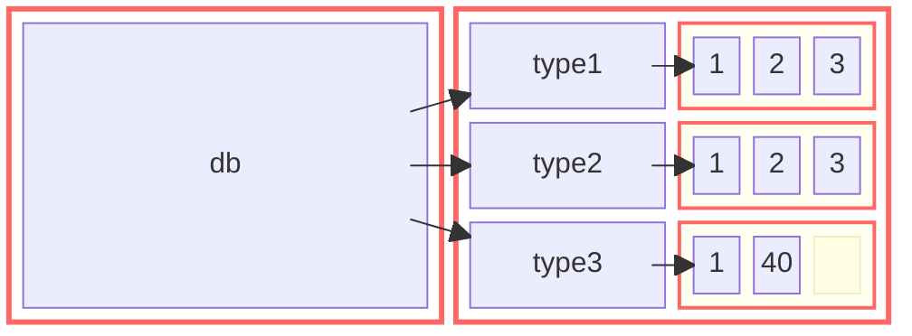
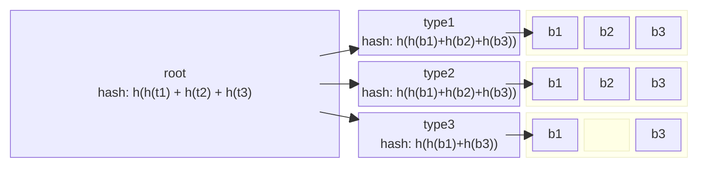

# Internals

## Memory Model

Each type (type1, type2, type2) has its own `mempool` that is used to allocate
nodes within that type. The nodes are normally allocated consecutively in
memory but deletions and new insertions may break that notion, as the `mempool`
system tries to keep all the allocations together for memory efficiency and
performance.

The nodes of each type are then linked together within in the type using a
rank-balanced tree. This is necessary because the nodes are not always in-order
in memory.

## Backups

### VerifTree

