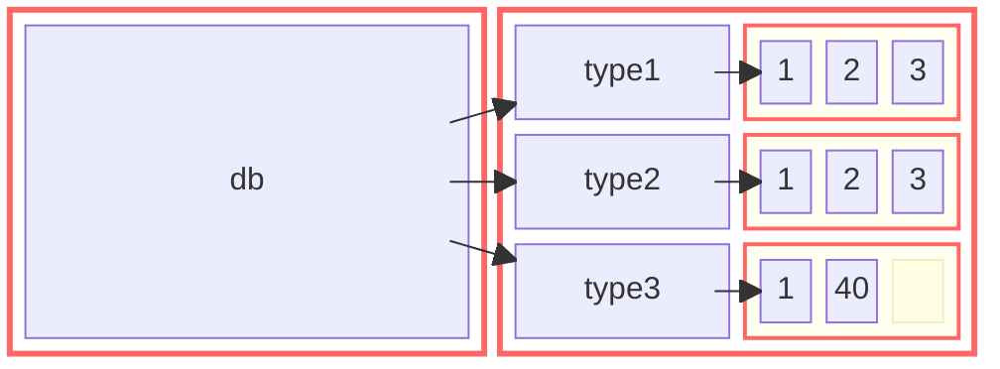
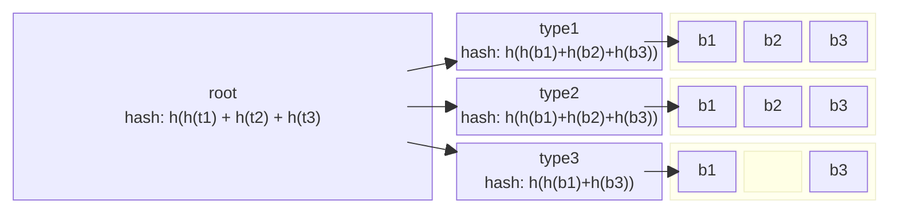

# Internals

## Preface

Internally Based is consist of several parts. At the lowest level of Based
there is the core database and its storage backend called Selva. The core
database can be loosely described as a relational database with some strict
restrictions and limits.

To draw some parallels between RDB/RDBMS and Based, we can consider that
in Based:

- Data is represented and stored as relations (nodes) in a collection of tables (types);
- Based provides relational operations to manipulate the data;
- Each table has its own unique key: `nodeId`;
- It's possible to define alternate keys as aliases;
- Finally references act in a similar way to foreign keys,
  representing one-to-one, one-to-many, and many-to-many relationships.

**Terminology**

| Relational database   | SQL           | Based             | Description                                   |
|-----------------------|---------------|-------------------|-----------------------------------------------|
| tuple/record          | row           | node              | A single item.                                |
| attribute/field       | column        | property/field    | A labeled element in an item.                 |
| domain                | type          | data type         | The data type of an element.                  |
| relation              | table         | type              | A set of items sharing the same properties.   |
| relation variable     | (base) table  | type/node schema  | The schema of an item (or node) in type.      |
| derived relvar        | view          | query response    | Any set of tuples as a response to a query.   |
| stored procedure      | 〃            | function          | A procedure that operates on the database.    |

Particularly limiting features in Based compared to most SQL databases are that
the primary key is always and foreign references are always made to the primary
keys.

## Memory Model



Each type (type1, type2, type2) has its own `mempool` that is used to allocate
nodes within that type. The nodes are normally allocated consecutively in
memory but deletions and new insertions may break that notion, as the `mempool`
system tries to keep all the allocations together for memory efficiency and
performance.

The nodes of each type are then linked together within in the type using a
rank-balanced tree. This is necessary because the nodes are not always in-order
in memory.

## Backups

### Files

```
% ls ../tmp
2_1_100000.sdb
3_1_100000.sdb
4_1_100000.sdb
common.sdb
schema.bin
writelog.json
```

**writelog.json**

```ts
type Writelog = {
    ts: number
    types: { [t: number]: { lastId: number; blockCapacity: number } }
    hash: string
    commonDump: string
    rangeDumps: {
      [t: number]: RangeDump[]
    }
}
```

```json
{
  "ts": 1755104843825,
  "types": {
    "2": {
      "lastId": 31,
      "blockCapacity": 100000
    },
    "3": {
      "lastId": 1,
      "blockCapacity": 100000
    },
    "4": {
      "lastId": 2,
      "blockCapacity": 100000
    }
  },
  "commonDump": "common.sdb",
  "rangeDumps": {
    "2": [
      {
        "file": "2_1_100000.sdb",
        "hash": "26a11ab0cb21490d56b96e25a2b46c82",
        "start": 1,
        "end": 100000
      }
    ],
    "3": [
      {
        "file": "3_1_100000.sdb",
        "hash": "cdd6b873374cc07805606f7e95e5b9c3",
        "start": 1,
        "end": 100000
      }
    ],
    "4": [
      {
        "file": "4_1_100000.sdb",
        "hash": "86187bd4f6e372949b2acd09f22fe75d",
        "start": 1,
        "end": 100000
      }
    ]
  },
  "hash": "3af775bbf3b07d124025dc550bc946e1"
}
```

**Selva binary dump serialization format (.sdb)**

SDB is a binary file format container used for Based DB block dumps. The data is
written in chunks (called blocks in the code) that are compressed with raw
deflate. The block size is determined by `ZBLOCK_BUF_SIZE` (1 MB in the current
version). The uncompressed size of blocks doesn't need to be stored because the
block size is fixed and the last block is padded if needed. This means that
reading the blocks is simple as decompressing a block will always result a full
block.

```
   | 00 01 02 03 04 05 06 07
===+=========================+
00 | 54 48 53 49 44 45 55 50 | Magic string
   |-------------------------|
08 | 00 00 00 00 00 00 00 00 | Created with version hash
10 | 00 00 00 00 00 00 00 00 | 40 bytes
18 | 00 00 00 00 00 00 00 00 | human-readable
20 | 00 00 00 00 00 00 00 00 |
28 | 00 00 00 00 00 00 00 00 |
   |-------------------------|
30 | 00 00 00 00 00 00 00 00 | Updated with version hash
38 | 00 00 00 00 00 00 00 00 | 40 bytes
40 | 00 00 00 00 00 00 00 00 | human-readable
48 | 00 00 00 00 00 00 00 00 |
50 | 00 00 00 00 00 00 00 00 |
   |-------------------------|
58 | 01 00 00 00|00 00 00 00 | uin32_t version | uint32_t flags
   |=========================|
60 |        D  A  T  A       | compressed or raw data
   |=========================|
   | 44 4e 45 41 56 4c 45 53 | Magic string (not padded)
   |-------------------------|
   | XX XX XX XX XX XX XX XX | Hash of the file
   | XX XX XX XX XX XX XX XX | from 0 to the beginning last magic string but
   | XX XX XX XX XX XX XX XX | over uncompressed data.
   | XX XX XX XX XX XX XX XX | binary
```

Reading the created and updated version with hexdump:
```
hexdump -s 8 -n 40 -e '40/1 "%c"' common.sdb
hexdump -s 48 -n 40 -e '40/1 "%c"' common.sdb
```

### VerifTree



## Partial Data

Currently as an experimental feature it's possible to offload parts of
the database to the disk (offline) and retrieve them later when needed. The
feature can be enabled by setting `partial: true` on a type schema.

** Example Schema**

```js
await db.setSchema({
  types: {
    event: {
      blockCapacity: 1025, // this many nodes per file
      insertOnly: true, // optional, only required with the experimental 'colvec' type
      partial: true, // Allows saving blocks of this type to be stored offline
      props: {
        extId: 'uint32',
        vec: { type: 'colvec', size: 8, baseType: 'float32' },
      },
    },
  },
})
```
