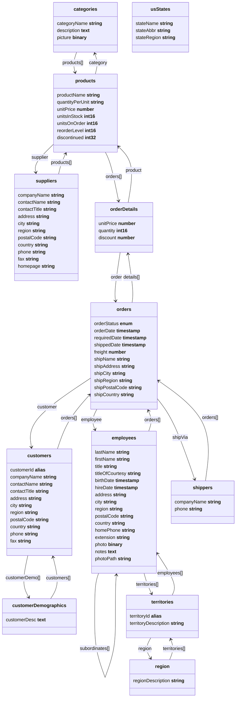

Migrating from SQL
==================

Northwind
---------

The [Northwind](https://github.com/atelier-saulx/based/blob/main/packages/db/test/shared/northwindDb.ts)
database is a sample database that was originally created by Microsoft and used in
many of their database tutorials. The Northwind database contains the sales data
for a fictitious company called “Northwind Traders”, which imports and exports
specialty foods from around the world. We have adapted a version of the
Northwind database to Based DB to demonstrate how easy it's to migrate from a
SQL database to Based DB.

