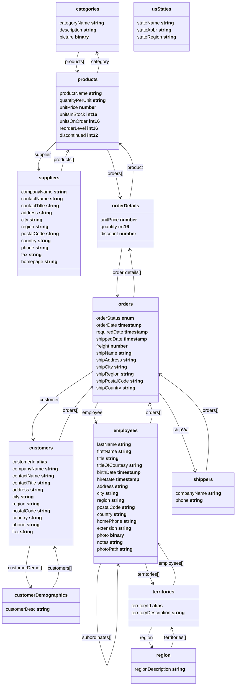

Migrating from SQL
==================

Northwind Sample Database
-------------------------

The [Northwind](https://github.com/atelier-saulx/based/blob/main/packages/db/test/shared/northwindDb.ts)
database is a sample database that was originally created by Microsoft and used in
many of their database tutorials. The Northwind database contains the sales data
for a fictitious company called “Northwind Traders”, which imports and exports
specialty foods from around the world. We have adapted a version of the
Northwind database to Based DB to demonstrate how easy it's to migrate from a
SQL database to Based DB.

The sample database can be found
[here](https://github.com/atelier-saulx/based/blob/main/packages/db/test/shared/northwindDb.ts)
and some examples
[here](https://github.com/atelier-saulx/based/blob/main/packages/db/test/examples/northwind.ts).



Select Queries
--------------

Basic SQL queries and their Based DB equivalents.

### Select

```sql
SELECT company_name,city FROM customers;
```

```js
await db.query('customers')
  .include('companyName', 'city')
  .get()
```

### Where

```sql
SELECT * FROM customers
WHERE country='Mexico';
```

```js
await db.query('customers')
  .filter('country', '=', 'Mexico')
  .get()
```

### Order By

```sql
SELECT * FROM products
ORDER BY price;
```

```js
await db.query('products')
  .sort('unitPrice', 'desc')
  .get()
```

### Select Top/Limit

```sql
SELECT * FROM products
ORDER BY price
LIMIT 3;
```

```js
await db.query('products')
  .sort('unitPrice', 'desc')
  .range(0, 3)
  .get()
```

Result:

```json
[
  {
    "id": 38,
    "productName": "Côte de Blaye",
    "quantityPerUnit": "12 - 75 cl bottles",
    "unitPrice": 263.5,
    "unitsInStock": 17,
    "unitsOnOrder": 0,
    "reorderLevel": 15,
    "discontinued": 0
  },
  {
    "id": 29,
    "productName": "Thüringer Rostbratwurst",
    "quantityPerUnit": "50 bags x 30 sausgs.",
    "unitPrice": 123.79,
    "unitsInStock": 0,
    "unitsOnOrder": 0,
    "reorderLevel": 0,
    "discontinued": 1
  },
  {
    "id": 9,
    "productName": "Mishi Kobe Niku",
    "quantityPerUnit": "18 - 500 g pkgs.",
    "unitPrice": 97,
    "unitsInStock": 29,
    "unitsOnOrder": 0,
    "reorderLevel": 0,
    "discontinued": 1
  }
]
```

### And and Or

### Insert

```sql
INSERT INTO customers (company_name, contact_name, address, city, postal_code, country)
VALUES ('Cardinal', 'Tom B. Erichsen', 'Skagen 21', 'Stavanger', '4006', 'Norway');
```

```js
db.create('customers', {
  companyName: 'Cardinal',
  contactName: 'Tom B. Erichsen',
  address: 'Skagen 21',
  city: 'Stavanger',
  postalCode: '4006',
  country: 'Norway',
})
```

### Update

```sql
UPDATE customers
SET contact_name = 'Haakon Christensen'
WHERE customer_id = 1;
```

```js
db.update('customers', 1, {
  contactName: 'Haakon Christensen',
})
```

### Delete

```sql
DELETE FROM customers WHERE customer_name='Cardinal';
```

```js
await db.delete('customers', (await db.query('customers').include('id').filter('companyName', '=', 'Cardinal').get().toObject())[0].id)
```

### Null Values

### Aggregate Functions

**MIN()**

```sql
SELECT MIN(unit_price)
FROM products;
```

```js
await db.query('products')
  .min('unitPrice')
  .get()
```

`MIN` with `GROUP BY`:

```sql
SELECT MIN(unit_price) AS SmallestPrice, category_id
FROM products
GROUP BY category_id;
```

```js
await db.query('products')
  .min('unitPrice')
  .groupBy('category')
  .get()
```

**MAX()**

```sql
SELECT MAX(unit_price)
FROM products;
```

```js
await db.query('products')
  .max('unitPrice')
  .get()
  .inspect()
```

**COUNT()**

```sql
SELECT COUNT(*)
FROM products;
```

```js
await db.query('products')
  .count()
  .get()
```

```sql
SELECT COUNT(DISTINCT unit_price)
FROM products;
```

```js
await db.query('products')
  .count('unitPrice')
  .get()
```

`COUNT` with `GROUP BY`:

```sql
SELECT COUNT(*) AS [number of products], category_id
FROM products
GROUP BY category_id;
```

```js
db.query('products')
  .count()
  .groupBy('category')
  .get()
```

Result:

```json
{
  "1": {
    "$count": 12
  },
  "2": {
    "$count": 12
  },
  "3": {
    "$count": 13
  },
  "4": {
    "$count": 10
  },
  "5": {
    "$count": 7
  },
  "6": {
    "$count": 6
  },
  "7": {
    "$count": 5
  },
  "8": {
    "$count": 12
  }
}
```

**SUM()**

```sql
SELECT SUM(quantity)
FROM order_details;
```

```js
await db.query('orderDetails')
  .sum('quantity')
  .get()
```

`SUM` with `WHERE`:

```sql
SELECT SUM(quantity)
FROM order_details
WHERE product_id = 11;
```

```js
await db.query('orderDetails')
  .sum('quantity')
  .filter('product.id', '=', 11)
  .get()
```

`SUM` with `GROUP BY`:

```sql
SELECT order_id, SUM(quantity) AS [Total Quantity]
FROM order_details
GROUP BY order_id;
```

```js
await db.query('orderDetails')
  .sum('quantity')
  .groupBy('order')
  .get()
```

**AVG()**

```sql
SELECT AVG(unit_price)
FROM products;
```

```js
await db.query('products').avg('unitPrice').get()
```

`AVG` with `WHERE`:

```sql
SELECT AVG(unit_price)
FROM products
WHERE category_id = 1;
```

```js
await db.query('products')
  .avg('unitPrice')
  .filter('category.id', '=', 1)
  .get()
```

Result:

```json
{
  "unitPrice": 37.979166666666664
}
```

`AVG` with `GROUP BY`:

```sql
SELECT AVG(unit_price) AS AveragePrice, category_id
FROM products
GROUP BY category_id;
```

```js
await db.query('products')
  .avg('unitPrice').groupBy('category').get()
```

A sample from the result:

```json
{
  "1": {
    "unitPrice": 37.979166666666664
  },
  "2": {
    "unitPrice": 22.854166666666668
  },
  "3": {
    "unitPrice": 25.16
  },
  "4": {
    "unitPrice": 28.73
  },
  "5": {
    "unitPrice": 20.25
  },
  "6": {
    "unitPrice": 54.00666666666667
  },
  "7": {
    "unitPrice": 32.37
  },
  "8": {
    "unitPrice": 20.6825
  }
}
```

### Like

**Starts with**

```sql
SELECT * FROM customers
WHERE company_name LIKE 'La%';
```

```sql
SELECT * FROM customers
WHERE company_name LIKE 'a%' OR company_name LIKE 'b%';
```

**Ends with**

```sql
SELECT * FROM customers
WHERE company_name LIKE '%a';
```

**Contains**

```sql
SELECT * FROM customers
WHERE company_name LIKE '%or%';
```

### In

```sql
SELECT * FROM customers
WHERE country IN ('Germany', 'France', 'UK');
```

```js
await db.query('customers')
  .filter('country', '=', ['Germany', 'France', 'UK'])
  .get()
```

A sample from the result:

```json
[
  {
    "id": 1,
    "companyName": "Alfreds Futterkiste",
    "contactName": "Maria Anders",
    "contactTitle": "Sales Representative",
    "address": "Obere Str. 57",
    "city": "Berlin",
    "region": "",
    "postalCode": "12209",
    "country": "Germany",
    "phone": "030-0074321",
    "fax": "030-0076545",
    "customerId": "ALFKI"
  },
  {
    "id": 4,
    "companyName": "Around the Horn",
    "contactName": "Thomas Hardy",
    "contactTitle": "Sales Representative",
    "address": "120 Hanover Sq.",
    "city": "London",
    "region": "",
    "postalCode": "WA1 1DP",
    "country": "UK",
    "phone": "(171) 555-7788",
    "fax": "(171) 555-6750",
    "customerId": "AROUT"
  },
  {
    "id": 6,
    "companyName": "Blauer See Delikatessen",
    "contactName": "Hanna Moos",
    "contactTitle": "Sales Representative",
    "address": "Forsterstr. 57",
    "city": "Mannheim",
    "region": "",
    "postalCode": "68306",
    "country": "Germany",
    "phone": "0621-08460",
    "fax": "0621-08924",
    "customerId": "BLAUS"
  }
]
```

### Between

```
SELECT * FROM products
WHERE unitPrice BETWEEN 10 AND 20
ORDER BY price;
```

```js
await db.query('products')
  .filter('unitPrice', '..', [10, 20])
  .sort('unitPrice', 'desc')
  .get()
```

### Aliases

In SQL alias names are used to rename tables or columns in the result.
Keep in mind that in Based DB alias as a term has a different meaning.

```sql
SELECT customer_id AS ID, company_name AS Customer
FROM customers;
```

```js
(await db.query('customers').include('companyName').get().toObject()).map((r) => ({ id: r.id, customer: r.companyName }))
```

### Inner Join

```sql
SELECT orders.OrderID, customers.company_name, orders.order_date
FROM orders
INNER JOIN customers ON orders.customer_id=customers.customer_id;
```

```js
await db.query('orders')
  .include('customer.company_name', 'order_date')
  .range(0, 10)
  .get()
```

### Left Join

```sql
SELECT customers.company_name, orders.order_id
FROM customers
LEFT JOIN orders
ON customers.customer_id=orders.customer_id
ORDER BY customers.company_name;
```

```js
await db.query('customers')
  .include('companyName', (q) => q('orders')
  .include('id'))
  .sort('companyName')
  .get()
```

### Right Join

Right join can be made in the similar way as left join.

### Full Join

```sql
SELECT customers.company_name, orders.order_id
FROM customers
FULL OUTER JOIN orders ON customers.customer_id=orders.customer_id
ORDER BY customers.company_name;
```

```js
const customers = await db.query('customers').get().toObject()
const orders = await db.query('orders').include('customer.id').get().toObject()
const result = [];

// LEFT JOIN: Customers with Orders
customers.forEach((customer) => {
  const matchingOrders = orders.filter((order) => order?.customer?.id === customer.id)
  if (matchingOrders.length > 0) {
    matchingOrders.forEach((order) => {
      result.push({
        companyName: customer.companyName,
        OrderId: order.id
      })
    })
  } else {
    result.push({
      companyName: customer.companyName,
      orderId: null
    })
  }
});

// RIGHT JOIN: Orders with no matching Customers
orders.forEach((order) => {
  const customer = customers.find((c) => c.id === order.customer?.id);
  if (!customer) {
    result.push({
      companyName: null,
      orderId: order.id
    });
  }
});

// Sort by companyName
result.sort((a, b) => {
  if (a.companyName === null) return 1;
  if (b.companyName === null) return -1;
  return a.companyName.localeCompare(b.companyName);
});

console.dir(result);
```

### Self Join

```sql
SELECT A.company_name AS CustomerName1, B.company_name AS CustomerName2, A.City
FROM customers A, customers B
WHERE A.customer_id <> B.customer_id
AND A.city = B.city
ORDER BY A.city;
```

```ts
  const result = []
  ;(
    (await db
      .query('customers')
      .include('customerId', 'companyName', 'city')
      .get()
      .toObject()) as {
      id: number
      customerId: string
      city: string
      companyName: string
    }[]
  ).forEach((a, _, customers) => {
    customers.forEach((b) => {
      if (a.city === b.city && a.customerId !== b.customerId) {
        result.push({
          customerA: a.customerId,
          customerB: b.customerId,
          city: a.city,
        })
      }
    })
  })
```

Result:

```json
[
  { customerA: 'ANATR', customerB: 'ANTON', city: 'México D.F.' },
  { customerA: 'ANATR', customerB: 'CENTC', city: 'México D.F.' },
  { customerA: 'ANATR', customerB: 'PERIC', city: 'México D.F.' },
  { customerA: 'ANATR', customerB: 'TORTU', city: 'México D.F.' },
  { customerA: 'ANTON', customerB: 'ANATR', city: 'México D.F.' },
  { customerA: 'ANTON', customerB: 'CENTC', city: 'México D.F.' },
  { customerA: 'ANTON', customerB: 'PERIC', city: 'México D.F.' },
  { customerA: 'ANTON', customerB: 'TORTU', city: 'México D.F.' },
  { customerA: 'AROUT', customerB: 'BSBEV', city: 'London' },
  { customerA: 'AROUT', customerB: 'CONSH', city: 'London' },
  { customerA: 'AROUT', customerB: 'EASTC', city: 'London' },
  { customerA: 'AROUT', customerB: 'NORTS', city: 'London' },
  { customerA: 'AROUT', customerB: 'SEVES', city: 'London' },
...
```

### Union

```sql
Union
SELECT 'customer' AS Type, contact_name, city, country
FROM customers
UNION
SELECT 'supplier', contact_name, city, country
FROM suppliers
```

```js
const unionA = await db.query('customers').include('contactName', 'city', 'country').get().toObject()
const unionB = await db.query('suppliers').include('contactName', 'city', 'country').get().toObject()
const union = [ ...unionA.map((r) => ({ type: 'customer', ...r })), ...unionB.map((r) => ({ type: 'supplier', ...r })) ]
```

### Union All

```sql
union all
SELECT city, country FROM customers
  WHERE country='Germany'
  UNION ALL
  SELECT city, country FROM suppliers
  WHERE country='Germany'
  ORDER BY city;
```

```js
console.log('union all')
const unionA = await db.query('customers').include('city', 'country').get().toObject()
const unionB = await db.query('suppliers').include('city', 'country').get().toObject()
const union = [
  ...unionA.map(({ city, country }) => ({ city, country })),
  ...unionB.map(({ city, country }) => ({ city, country }))
].sort((a, b) => a.city.localeCompare(b.city))
```

### Having

### Exists

Modifying Data
--------------

### Insert

```js
const res = db.create('customers', {
  companyName: 'Cardinal',
  contactName: 'Tom B. Erichsen',
  address: 'Skagen 21',
  city: 'Stavanger',
  postalCode: '4006',
  country: 'Norway',
})
```

### Update

```js
db.update('customers', id, {
  contactName: 'Haakon Christensen',
})
```

### Delete

**Deleting a single node**

```js
await db.delete('customers', id)
```


**Delete WELLI**

```js
db.delete('customers', (await db.query('customers', { customerId: 'WELLI' }).get()).id)
```

**Delete all orders by WANDK**

```js
const wandk = await db.query('customers', { customerId: 'WANDK' }).get()
const wandkOrders = await db.query('orders').filter('customer', '=', wandk).get()
for (const order of wandkOrders) {
  db.delete('orders', order.id)
}
```
