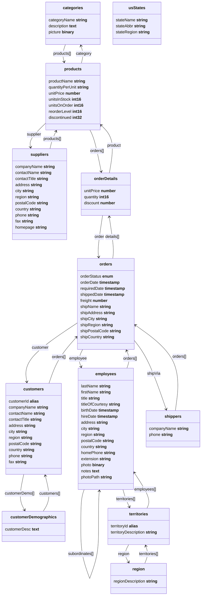

Migrating from SQL
==================

Northwind
---------

The [Northwind](https://github.com/atelier-saulx/based/blob/main/packages/db/test/shared/northwindDb.ts)
database is a sample database that was originally created by Microsoft and used in
many of their database tutorials. The Northwind database contains the sales data
for a fictitious company called “Northwind Traders”, which imports and exports
specialty foods from around the world. We have adapted a version of the
Northwind database to Based DB to demonstrate how easy it's to migrate from a
SQL database to Based DB.

The sample database can be found
[here](https://github.com/atelier-saulx/based/blob/main/packages/db/test/shared/northwindDb.ts)
and some examples
[here](https://github.com/atelier-saulx/based/blob/main/packages/db/test/examples/northwind.ts).



Queries
-------

### Inner Join

```sql
SELECT orders.OrderID, customers.company_name, orders.order_date
FROM orders
INNER JOIN customers ON orders.customer_id=customers.customer_id;
```

```ts
await db.query('orders').include('customer.company_name', 'order_date').range(0, 10).get()
```

### Left Join

```sql
SELECT customers.company_name, orders.order_id
FROM customers
LEFT JOIN orders
ON customers.customer_id=orders.customer_id
ORDER BY customers.company_name;
```

```ts
await db.query('customers').include('companyName', (q) => q('orders').include('id')).sort('companyName').get()
```

### Select

```sql
SELECT company_name,city FROM customers;
```

```ts
await db.query('customers').include('companyName', 'city').get()
```

### Where

```sql
SELECT * FROM customers
WHERE country='Mexico';
```

```ts
await db.query('customers').filter('country', '=', 'Mexico').get()
```

### Order By

```sql
SELECT * FROM products
ORDER BY price;
```

```ts
await db.query('products').sort('unitPrice', 'desc').get()
```

### Select Top/Limit

```sql
SELECT * FROM products
ORDER BY price
LIMIT 3;
```

```ts
await db.query('products').sort('unitPrice', 'desc').range(0, 3).get()
```

```json
[
  {
    id: 38,
    productName: 'Côte de Blaye',
    quantityPerUnit: '12 - 75 cl bottles',
    unitPrice: 263.5,
    unitsInStock: 17,
    unitsOnOrder: 0,
    reorderLevel: 15,
    discontinued: 0
  },
  {
    id: 29,
    productName: 'Thüringer Rostbratwurst',
    quantityPerUnit: '50 bags x 30 sausgs.',
    unitPrice: 123.79,
    unitsInStock: 0,
    unitsOnOrder: 0,
    reorderLevel: 0,
    discontinued: 1
  },
  {
    id: 9,
    productName: 'Mishi Kobe Niku',
    quantityPerUnit: '18 - 500 g pkgs.',
    unitPrice: 97,
    unitsInStock: 29,
    unitsOnOrder: 0,
    reorderLevel: 0,
    discontinued: 1
  }
]
```

### And and Or

### Insert

```sql
INSERT INTO customers (company_name, contact_name, address, city, postal_code, country)
VALUES ('Cardinal', 'Tom B. Erichsen', 'Skagen 21', 'Stavanger', '4006', 'Norway');
```

```ts
db.create('customers', {
  companyName: 'Cardinal',
  contactName: 'Tom B. Erichsen',
  address: 'Skagen 21',
  city: 'Stavanger',
  postalCode: '4006',
  country: 'Norway',
})
```

### Update

```sql
UPDATE customers
SET contact_name = 'Haakon Christensen'
WHERE customer_id = 1;
```

```ts
db.update('customers', 1, {
  contactName: 'Haakon Christensen',
})
```

### Delete

```sql
DELETE FROM customers WHERE customer_name='Cardinal';
```

```ts
await db.delete('customers', (await db.query('customers').include('id').filter('companyName', '=', 'Cardinal').get().toObject())[0].id)
```

### Null Values

### Aggregate Functions

**MIN()**

```sql
SELECT MIN(unit_price)
FROM products;
```

```ts
await db.query('products').min('unitPrice').get()
```

`MIN` with `GROUP BY`:

```sql
SELECT MIN(unit_price) AS SmallestPrice, category_id
FROM products
GROUP BY category_id;
```

```ts
await db.query('products').min('unitPrice').groupBy('category').get()
```

**MAX()**

```sql
SELECT MAX(unit_price)
FROM products;
```

```ts
await db.query('products').max('unitPrice').get().inspect()
```

**COUNT()**

```sql
SELECT COUNT(*)
FROM products;
```

```ts
await db.query('products').count().get()
```

```sql
SELECT COUNT(DISTINCT unit_price)
FROM products;
```

```ts
await db.query('products').count('unitPrice').get()
```

`COUNT` with `GROUP BY`:

```sql
SELECT COUNT(*) AS [number of products], category_id
FROM products
GROUP BY category_id;
```

```ts
db.query('products').count().groupBy('category').get()
```

**SUM()**

```sql
SELECT SUM(quantity)
FROM order_details;
```

```ts
await db.query('orderDetails').sum('quantity').get()
```

`SUM` with `WHERE`:

```sql
SELECT SUM(quantity)
FROM order_details
WHERE product_id = 11;
```

```ts
await db.query('orderDetails').sum('quantity').filter('product.id', '=', 11).get()
```

`SUM` with `GROUP BY`:

```sql
SELECT order_id, SUM(quantity) AS [Total Quantity]
FROM order_details
GROUP BY order_id;
```

```ts
await db.query('orderDetails').sum('quantity').groupBy('order').get()
```

**AVG()**

```sql
SELECT AVG(unit_price)
FROM products;
```

```ts
await db.query('products').avg('unitPrice').get()
```

`AVG` with `WHERE`:

```sql
SELECT AVG(unit_price)
FROM products
WHERE category_id = 1;
```

```ts
await db.query('products').avg('unitPrice').filter('category.id', '=', 1).get()
```

`AVG` with `GROUP BY`:

```sql
SELECT AVG(unit_price) AS AveragePrice, category_id
FROM products
GROUP BY category_id;
```

```ts
await db.query('products').avg('unitPrice').groupBy('category').get()
```

### Like

**Starts with**

```sql
SELECT * FROM customers
WHERE company_name LIKE 'La%';
```

```sql
SELECT * FROM customers
WHERE company_name LIKE 'a%' OR company_name LIKE 'b%';
```

**Ends with**

```sql
SELECT * FROM customers
WHERE company_name LIKE '%a';
```

**Contains**

```sql
SELECT * FROM customers
WHERE company_name LIKE '%or%';
```

### In

```sql
SELECT * FROM customers
WHERE country IN ('Germany', 'France', 'UK');
```

```ts
await db.query('customers').filter('country', '=', ['Germany', 'France', 'UK']).get().inspect()
```

### Between

```
SELECT * FROM products
WHERE unitPrice BETWEEN 10 AND 20
ORDER BY price;
```

```ts
await db.query('products').filter('unitPrice', '..', [10, 20]).sort('unitPrice', 'desc').get()
```

### Aliases

In SQL alias names are used to rename tables or columns in the result.
Keep in mind that in Based DB alias as a term has a different meaning.

```sql
SELECT customer_id AS ID, company_name AS Customer
FROM customers;
```

```ts
(await db.query('customers').include('companyName').get().toObject()).map((r) => ({ id: r.id, customer: r.companyName }))
```

### Right Join

### Full Join

### Self Join

### Union

```sql
Union
SELECT 'customer' AS Type, contact_name, city, country
FROM customers
UNION
SELECT 'supplier', contact_name, city, country
FROM suppliers
```

```ts
const unionA = await db.query('customers').include('contactName', 'city', 'country').get().toObject()
const unionB = await db.query('suppliers').include('contactName', 'city', 'country').get().toObject()
const union = [ ...unionA.map((r) => ({ type: 'customer', ...r })), ...unionB.map((r) => ({ type: 'supplier', ...r })) ]
```

### Union All

```sql
union all
SELECT city, country FROM customers
  WHERE country='Germany'
  UNION ALL
  SELECT city, country FROM suppliers
  WHERE country='Germany'
  ORDER BY city;
```

```ts
console.log('union all')
const unionAllA = await db.query('customers').include('city', 'country').get().toObject()
const unionAllB = await db.query('suppliers').include('city', 'country').get().toObject()
const unionAll = [ ...unionA.map(({ city, country }) => ({ city, country })), ...unionB.map(({ city, country }) => ({ city, country })) ].sort((a, b) => a.city.localeCompare(b.city))
```

### Having

### Exists
