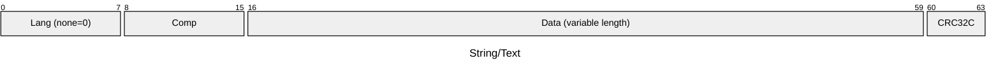
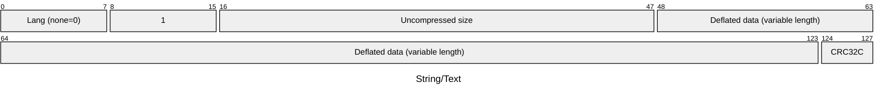
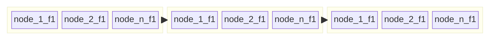

# Types

## Timestamp

```js
await db.setSchema({
  types: {
    user: {
      props: {
        birthday: {
          type: 'timestamp',
        },
        createdAt: {
          type: 'timestamp',
          on: 'create',
        },
        updatedAt: {
          type: 'timestamp',
          on: 'update',
        },
      },
    },
  },
})
```

## Boolean

```js
await db.setSchema({
  types: {
    article: {
      props: {
        published: 'boolean',
      },
    },
  },
})

db.create('article', {
  published: false,
})
```

## Numeric

```js
await db.setSchema({
  types: {
    user: {
      props: {
        number: 'number',
        int8: 'int8',
        uint8: 'uint8',
        int16: 'int16',
        uint16: 'uint16',
        int32: 'int32',
        uint32: 'uint32',
      },
    },
  },
})
```

## Alias

```js
await db.setSchema({
  types: {
    vendor: {
      props: {
        vendorId: 'alias',
        name: 'string',
      },
    },
  }
})

// Suppose vendorId comes from an external system
db.create('vendor', {
  vendorId: '1',
  name: 'Vendor A',
})

// Vendor A is still there but the id is now taken by Vendor B
db.upsert('vendor', {
  vendorId: '1',
  name: 'Vendor B',
})
```

## Enum

```js
await db.setSchema({
  types: {
    pokemon: {
      props: {
        type: {
          type: 'enum',
          enum: ['normal', 'fire', 'water', 'electric', 'grass', 'flying', 'bug', 'rock'],
          default: 'normal',
        },
      },
    },
  },
})
```

## JSON

```js
await db.setSchema({
  types: {
    person: {
      name: 'string',
      myJson: 'json',
    },
  },
})

await db.create('person', {
  name: 'jason',
  myJson: {
    bllz: {
      to: {
        the: 'wallz',
      },
    },
  },
})
```

## Binary

```js
await db.setSchema({
  types: {
    doc: {
      props: {
        file: { type: 'binary' },
      },
    },
  },
})
```

## String and Text

A string field can contain a single UTF-8 string of either unlimited length or
fixed length. A Text field can contain an UTF-8 string translations of the same
text in any supported language.

```js
await db.setSchema({
  locales: {
    en: {},
    fi: { fallback: 'en' },
  },
  types: {
    user: {
      props: {
        name: { type: 'string' },
        email: { type: 'string', max: 15 },
        age: 'uint32',
        bio: { type: 'text' },
      },
    },
  },
})

db.create('user', {
  name: 'Bob',
  email: 'bob',
  age: 30,
  bio: { en: 'Empty.', fi: 'Tyhjä.' },
})
```

### Storage Format

#### Normalization

String and text fields use [NFKD normalization](https://unicode.org/reports/tr15/),
which helps the database to implement extremely fast text search.
However, the normalization may cause some loss of information in certain cases
due to its irreversible nature and in rare cases the meaning of the string may
change.

**Example**

```js
const buf1 = Buffer.from('ÅffiⅨ'.normalize('NFKD'), 'utf-8')
const buf2 = Buffer.from('ÅffiⅨ', 'utf-8')
console.log(buf1)
console.log(buf1.toString())
console.log(buf2)
console.log(buf2.toString())
```

Prints:

```
<Buffer 41 cc 8a 66 66 69 49 58>
ÅffiIX
<Buffer c3 85 ef ac 83 e2 85 a8>
ÅffiⅨ
```

In some cases the user might want to store string in a non-lossy manner.
Currently this can be achieved by storing the string(s) in a `binary` field.

#### In-memory

Internally every string in the database is stored as follows:


where

| Comp | Description    |
| ---- | -------------- |
| 0    | No compression |
| 1    | Raw deflate    |

**Comp=1**



In the compressed case the CRC32C value is calculated over the uncompressed data.
It's done like this to protect the data from both, errors while stored in compressed
format as well as decompression errors. Moreover, a slight change in the compressed
data may affect multiple bits in the decompression output and thus more easily result
a CRC32C value that is correvt, even if the output is not correct. The downside is
that the deflate decompression code must be more robust against bit errors.

### String Search

- TODO Describe how the search works at high level
- TODO Query examples

### External Links

- [Unicode Normalization Forms, Unicode® Standard Annex #15](https://unicode.org/reports/tr15/)
- [DerivedNormalizationProps-16.0.0.txt, Unicode®](https://www.unicode.org/Public/UCD/latest/ucd/DerivedNormalizationProps.txt)
- [Unicode equivalence, Wikipedia](https://en.wikipedia.org/wiki/Unicode_equivalence)

## Cardinality

```js
await db.setSchema({
  types: {
    page: {
      uniqueVisitors: 'cardinality',
    },
  },
})
```

## vector

```js
await db.setSchema({
  types: {
    data: {
      props: {
        row: {
          type: 'vector',
          size: 5,
          baseType: 'float32',
        },
      },
    },
  },
})
```

| Schema prop | Required | Type               | Default            | Description |
|-------------|----------|--------------------|--------------------|-------------|
| `size`      | &check;  | `number` (integer) |                  - | Number of elements in the vector. |
| `baseType`  | &cross;  | `string`           | `number`/`float64` | Vector element type. Can be any of the numeric types. |
| `default`   | &cross;  | `TypedArray`       | Default value. |


## colvec

```js
await db.setSchema({
  types: {
    col: {
      blockCapacity: 10_000,
      insertOnly: true,
      props: {
        vec: {
          type: 'colvec',
          size: 8,
          baseType: 'float32',
        },
      },
    },
  },
})

db.create('col', {
  vec: new Float32Array([
    2311,
    5054,
    1.5612034346858506e-39,
    1.007378107771942e-37,
    3.76158192263132e-37,
    1.6815581571897805e-44,
    0,
    5391
  ]),
})
```

| Schema prop | Required | Type               | Default            | Description |
|-------------|----------|--------------------|--------------------|-------------|
| `size`      | &check;  | `number` (integer) |                  - | Number of elements in the vector. |
| `baseType`  | &cross;  | `string`           | `number`/`float64` | Vector element type. Can be any of the numeric types. |
| `default`   | &cross;  | `TypedArray`       | Default value. |

`colvec` is a columnar property type where each column is stored as big
contiguous arrays. When Based processes a `colvec` property in a query, it works
on batches of property values, instead of one node and property at a time.
`colvec`s are stored in `size * blockCapacity` sized arrays in-memory. This
makes it possible to utilize hardware-level vectorization of queries on `colvec`
props.


