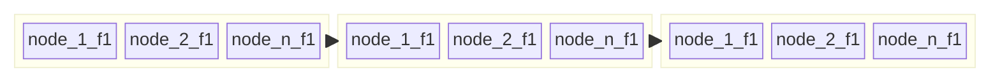

# Vectors

## vector

```ts
await db.setSchema({
  types: {
    data: {
      props: {
        row: {
          type: 'vector',
          size: 5,
        },
      },
    },
  },
})
```

## colvec

```ts
await db.setSchema({
  types: {
    col: {
      blockCapacity: 10_000,
      insertOnly: true,
      props: {
        vec: { type: 'colvec', size: 8 },
      },
    },
  },
})
```



`colvec` fields are stored on `size * blockCapacity` sized arrays in-memory.
