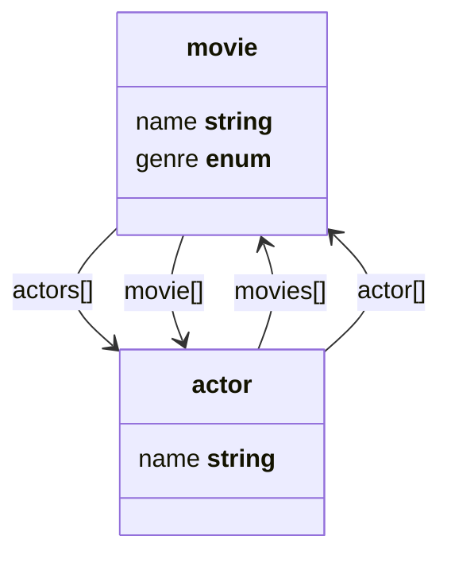

# Schema Diagrams

Simple function in based/schema to convert your schema to a mermaid.

## Install

```bash

```

## Example usage

```js
import { parse } from '@based/schema'
import { mermaid } from '@based/schema-diagram'

const schema = {
  types: {
    movie: {
      name: 'string',
      genre: ['Comedy', 'Thriller', 'Drama', 'Crime'],
      actors: {
        items: {
          ref: 'actor',
          prop: 'actor',
        },
      },
    },
    actor: {
      name: 'string',
      movies: {
        items: {
          ref: 'movie',
          prop: 'movie',
        },
      },
    },
  },
}
const parsed = parse(schema).schema

console.dir(parsed, { depth: null })
console.log('schema parsed successfully')
console.log(mermaid(parsed))
```

with [mermaid.js](https://github.com/mermaid-js/mermaid) the `console.log()` yields:


