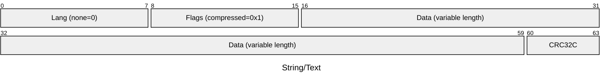

# String and Text Fields

A string field can contain a single UTF-8 string of either unlimited length or
fixed length. a Text field can contain an UTF-8 string translations of the same
text in any supported language.

```js
await db.setSchema({
  types: {
    user: {
      props: {
        name: { type: 'string' },
        email: { type: 'string', max: 15 },
        age: 'uint32',
        bio: { type: 'text' },
      },
    },
  },
})
```

## Storage Format

String and text fields use [NFKD normalization](https://unicode.org/reports/tr15/),
which helps the database to implement extremely fast text search.
However, the normalization may cause some loss of information in certain cases
due to its irreversible nature and in rare cases the meaning of the string may
change.

**Example**

```js
const buf1 = Buffer.from('ÅffiⅨ'.normalize('NFKD'), 'utf-8');
const buf2 = Buffer.from('ÅffiⅨ', 'utf-8');
console.log(buf1);
console.log(buf1.toString());
console.log(buf2);
console.log(buf2.toString());
```

Prints:

```
<Buffer 41 cc 8a 66 66 69 49 58>
ÅffiIX
<Buffer c3 85 ef ac 83 e2 85 a8>
ÅffiⅨ
```

In some cases the user might want to store string in a non-lossy manner.
Currently this can be achieved by storing the string(s) in a `binary` field.


Internally every string in the database is stored as follows:



## String Search

- TODO Describe how the search works at high level
- TODO Query examples

## External Links

- [Unicode Normalization Forms, Unicode® Standard Annex #15](https://unicode.org/reports/tr15/)
- [DerivedNormalizationProps-16.0.0.txt, Unicode®](https://www.unicode.org/Public/UCD/latest/ucd/DerivedNormalizationProps.txt)
- [Unicode equivalence, Wikipedia](https://en.wikipedia.org/wiki/Unicode_equivalence)
