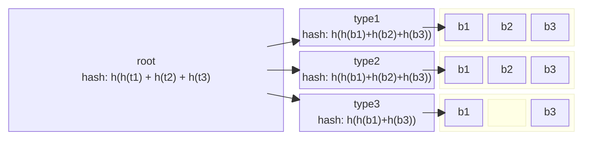

VerifTree
=========

```mermaid
block-beta
  columns 2
  block:ROOT:1
    columns 1
    r["root<br/>hash: h(h(t1) + h(t2) + h(t3)"]
  end
  block:TYPES:1
  columns 2
  t1["type1<br/>hash: h(h(b1)+h(b2)+h(b3))"]
  r-->t1
  block:T1:1
    t1-->t1b1["b1"]
    t1b2["b2"]
    t1b3["b3"]
  end
  t2["type2<br/>hash: h(h(b1)+h(b2)+h(b3))"]
  r-->t2
  block:T2:1
    t2-->t2b1["b1"]
    t2b2["b2"]
    t2b3["b3"]
  end
  t3["type3<br/>hash: h(h(b1)+h(b3))"]
  r-->t3
  block:T3:1
    t3-->t3b1["b1"] 
    block
      space
    end
    t3b3["b3"]
  end
  end
  style ROOT fill:#0000,stroke-width:0
  style TYPES fill:#0000,stroke-width:0
```
